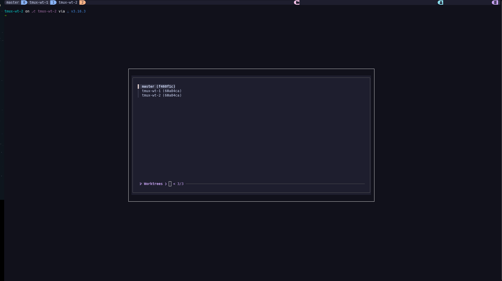

# tmux-wt

A blazingly fast tmux plugin written in modern C++ (C++17) that seamlessly integrates Git Worktrees
with tmux sessions. 

`tmux-wt` reads your current Git repository, parses your active worktrees, and displays them in a
native tmux interactive menu. Selecting a worktree instantly switches your tmux client to a
dedicated session for that branch, creating it in the background if it doesn't already exist.

<p align="center">
  
</p>

## Features

- **Blazing Fast Parsing:** Core logic is written in C++17, ensuring zero lag when parsing
                            repositories with numerous worktrees.

- **Multiple UIs:** Choose between a dependency-free native `tmux display-menu` or a rich floating
                popup powered by `fzf` with Catppuccin styling.

- **Window Isolation:** Each worktree gets its own tmux window automatically, keeping your terminal
                    environments clean and reducing session clutter.

- **Context Aware:** Extracts the short SHA-1 and branch names, automatically falling back to the
                 directory name for detached HEAD worktrees.

- **Seamless Clipboard:** Copy worktree names directly to your system clipboard using native X11
                      integration.

## Prerequisites

To build and use `tmux-wt`, you need the following installed on your system:

- `tmux` (>= 3.0 recommended for menu support)
- `git`
- `cmake` (>= 3.15)
- A C++17 compatible compiler (`clang++` or `g++`)

### Optional Requirements (For FZF UI)

- `fzf` (For the interactive fuzzy finder menu)
- `xclip` (For Linux X11 system clipboard integration)

You can easily install the optional dependencies on Debian/Ubuntu systems:

```bash
sudo apt update && sudo apt install fzf xclip
```

## Installation

Since `tmux-wt` relies on a compiled C++ binary for its core logic, it is recommended to clone the
repository and build it locally before adding it to your tmux configuration.

### Option A: Download Pre-compiled Binary (Linux AMD64)

1. Clone the repository:

```bash
git clone https://github.com/Rique-rev/tmux-wt.git ~/tmux-wt
cd ~/tmux-wt
mkdir build
```

2. Download the binary:
Fetch the latest release directly from GitHub and give it execution permissions
(make sure to replace v1.0.0 with the latest version available on the Releases page):

```bash
wget https://github.com/Rique-rev/tmux-wt/releases/download/v1.0.0/tmux-wt-linux-amd64 -O ~/tmux-wt/build/tmux-wt
chmod +x ~/tmux-wt/build/tmux-wt
```

### Option B: Clone the repository

Choose a location for the plugin (e.g., your generic projects folder or `~/.tmux/plugins/`).

```bash
cd ~/tmux-wt
mkdir build
cd build
cmake ..
cmake --build .
```

## Configure your .tmux.conf

### Option A: Native Tmux UI (Default)

```bash
run-shell "~/tmux-wt/tmux-wt.tmux"
```
### Option B: Native Tmux UI (Default)

```bash
run-shell "~/tmux-wt/tmux-wt-fzf.tmux"
```

## Reload tmux

```bash
tmux source-file ~/.tmux.conf
```

## Configuration

By default, the plugin binds the menu to Prefix + g.

If you wish to change the keybinding
(for example, to avoid conflicts with vim-like pane navigation), open the tmux-wt.tmux script in
the root of this repository and change the KEY_BINDING variable:

```bash
# Inside tmux-wt.tmux
KEY_BINDING="g" # Change 'g' to your preferred key
```

Note: Remember to reload your ~/.tmux.conf after modifying the script.

## Usage

1. Inside a tmux session, navigate to any directory that is a Git repository.

2. Press your tmux prefix (usually Ctrl+b or Ctrl+a), followed by g.

3. A menu will pop up displaying your current worktrees along with their short SHA-1 hashes.

4. Navigation:
    - Native UI: Press the corresponding number.
    - fzf UI: Use the arrow keys (or Ctrl+j/Ctrl+k), type to fuzzy-search, and press Enter.
    - Copy Name (fzf UI Only): Press y over a selected worktree to silently copy its exact
      branch/directory name to your OS clipboard (Ctrl+Shift+V).
